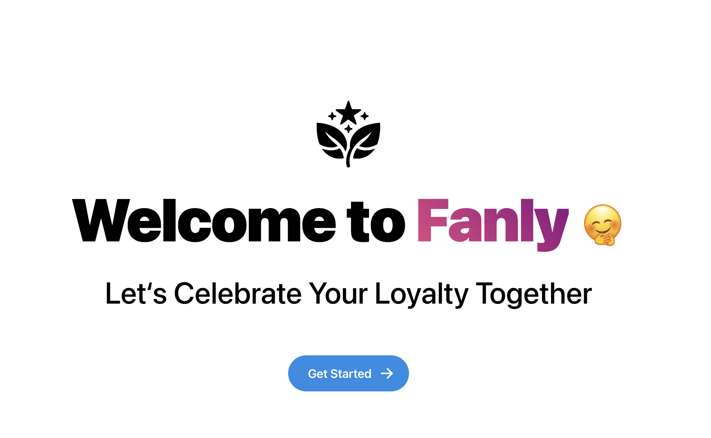

<br/>
<p align="center">
  <a href="https://github.com/ha0min/loyalweb">
    
  </a>

  <h3 align="center">Fanly</h3>

  <p align="center">
    A web application for loyalty rewards
    <br/>
    <br/>
    <a href="https://github.com/ha0min/loyalweb">View Demo</a>
    .
    <a href="https://github.com/ha0min/loyalweb/issues">Report Bug</a>
    .
    <a href="https://github.com/ha0min/loyalweb/issues">Request Feature</a>
  </p>
</p>

    

## Table Of Contents

* [About the Project](#about-the-project)
* [Built With](#built-with)
* [Getting Started](#getting-started)
  * [Deploy with Vercel](#deploy-with-vercel)
  * [Run on device](#run-on-device)
* [Usage](#usage)
* [License](#license)
* [Authors](#authors)

## About The Project



This project is the frontend part of a web application designed to manage a loyalty program. It includes two layouts for both user and admin. Features includes user authentication, reward history tracking, product listing, shopping cart management, and order processing, etc. You could find the backend code here: [Loyalty Rewards Application](https://github.com/LLLbin/loyalty-rewards-application).

## Built With

 The application is built using Next.js, SWR for data fetching, Mantine and Ant Design for UI components, and Jotai for state management.

## Getting Started

This is an example of how you may give instructions on setting up your project locally.
To get a local copy up and running follow these simple example steps.

### Deploy with Vercel

1. Fork this repo and click the *Deploy With Vercel* button:  [](https://vercel.com/new/clone?repository-url=https%3A%2F%2Fgithub.com%2Fha0min%2Floyalweb&env=API_URL&envDescription=Add%20the%20backend%20api%20url%20here.)

2. Set the environment variable `API_URL` in vercel for the backend server.

3. You are all set to go!

### Run on device

To get started with this project, clone the repository and install the dependencies:

```sh
git clone https://github.com/ha0min/loyalweb.git
cd your-repo-name
npm install
```

To run the application:

```sh
npm run dev
```

This will start the Next.js server, typically on http://localhost:3000.


### Creating A Pull Request

1. Fork the Project
2. Create your Feature Branch (`git checkout -b feature/AmazingFeature`)
3. Commit your Changes (`git commit -m 'Add some AmazingFeature'`)
4. Push to the Branch (`git push origin feature/AmazingFeature`)
5. Open a Pull Request

## License

Distributed under the MIT License.

## Authors

* **Haomin** - [Haomin](https://github.com/ha0min)
